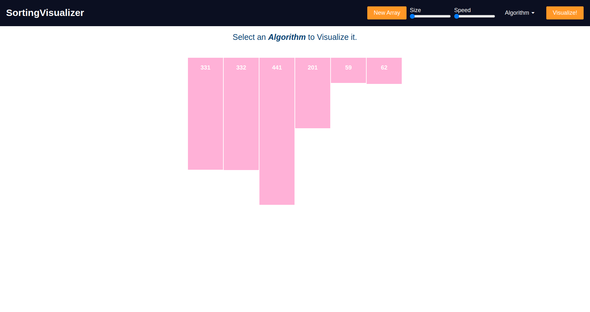
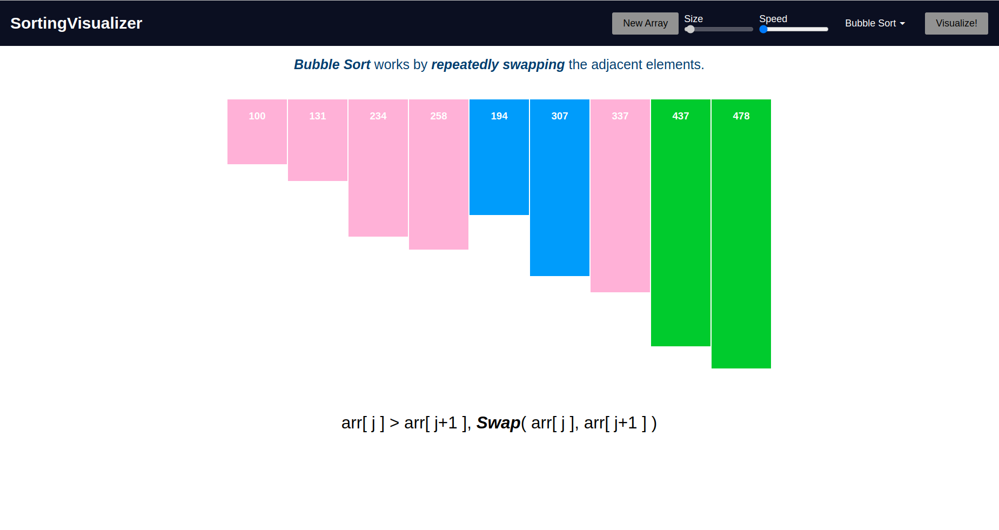

  

# SortingVisualizer

This is a simple Angular project help to visualize various sorting Algorithm.
This project was generated with [Angular CLI](https://github.com/angular/angular-cli) version 15.0.4.


## Algorithm you can visualize

- Bubble Sort 
- Selection Sort
- Insertion Sort
- Quick Sort
- Merge Sort

## Building from source

Clone this repository and run

```
ng build
```

The build will result in a single `index.html` and other `.js`  file that is made available in the `docs` directory.


## Running the application

```
ng serve --open
```

Navigate to http://localhost:4200 to access the application.

### Deploy Project <br/>

[Check out the deploy website here](https://manishdait.github.io/Sorting-Visualizer/)

 <br/>
 <br/>
 <br/>
