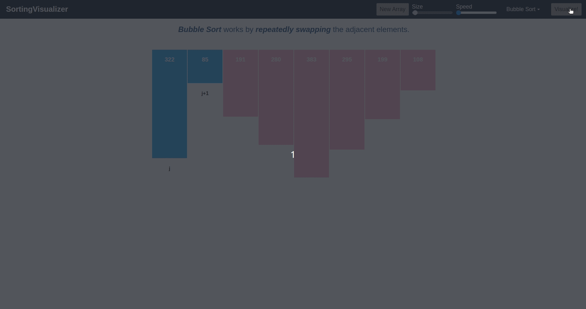

# Sorting Visualizer


`Sorting Visualizer` is a web application made in `Angular` that visualizes various sorting algorithms in action. It is a great tool for learning how sorting algorithms work.

## Getting Started

### Prerequisites

In order to use `Sorting Visualizer`, you will need to have the following installed on your machine:

- `Node.js` and `npm` (Node Package Manager)
- `Angular CLI`

### Installation

To install `Sorting Visualizer`, you can follow these steps:

1. Clone the repository:

```
git clone https://github.com/ManishDait/Sorting-Visualizer.git
```
Alternatively, you can download the source code as a ZIP file and extract it to a directory of your choice.

2. Navigate to the project directory and install the dependencies:

```
cd Sorting-Visualizer
```
```
npm install
```

### Usage

To run `Sorting Visualizer`, you can use the following command:

```
ng serve
```

Navigate to `http://localhost:4200/` to view the application in your web browser.

## Features

`Sorting Visualizer` provides the following features:

- Visualizes various sorting algorithms, including `Bubble Sort`, `Insertion Sort`, `Selection Sort`, `Quick Sort`, and `Merge Sort`
- Allows users to adjust the size of the array being sorted and the speed at which the visualization runs
- Highlights the elements of the array being compared and swapped during each step of the sorting process

## Demo



[Check out the deploy website here](https://manishdait.github.io/Sorting-Visualizer/)


## License

`Sorting Visualizer` is licensed under the `MIT License`. See the `LICENSE` file for more information.


